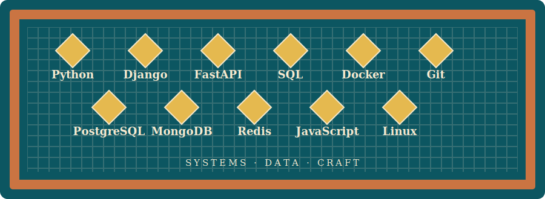

## Profile

I am Seyedmahdi Hosseini, a backend-oriented Computer Science master's student based in Tübingen. I enjoy making systems understandable, reliable, and efficient - especially where application code meets data.

My experience includes designing backend services with Python and Django, building REST APIs, improving database performance, and supporting production-facing web applications and data workflows.

## Technical toolkit

| Area            | Tools and experience                                                      |
| --------------- | ------------------------------------------------------------------------- |
| Languages       | Python, Java, JavaScript, SQL                                             |
| Backend         | Django, FastAPI, REST APIs                                                |
| Data            | PostgreSQL, MongoDB, Redis, relational databases, query optimisation      |
| Delivery        | Docker, Linux, Git, containerised workflows                               |
| Applied systems | Data validation, AI data pipelines, internal web applications, OutSystems |

## Education

### M.Sc. Computer Science - University of Tübingen

2025 - present · Tübingen, Germany  
Focus: scalable backend systems, databases, AI systems, and software engineering.

### B.Sc. Computer Science - University of Zanjan

Completed 2024 · Zanjan, Iran  
Also worked for three years as a student tutor for advanced programming courses.

## Languages

- Persian - native
- German - C1
- English - B2

For a chronological view of my work, see [[experience/index|Experience]].
