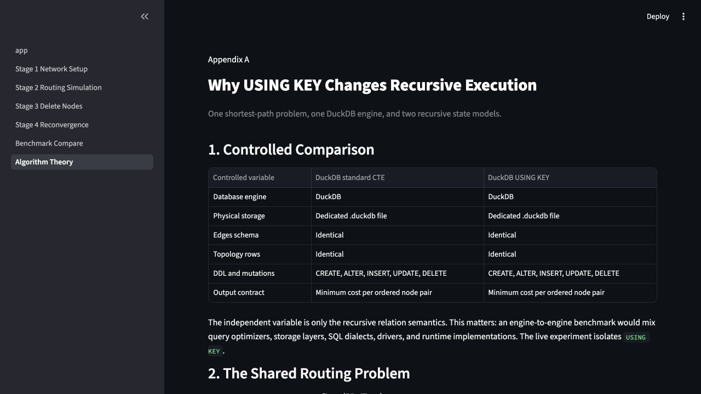
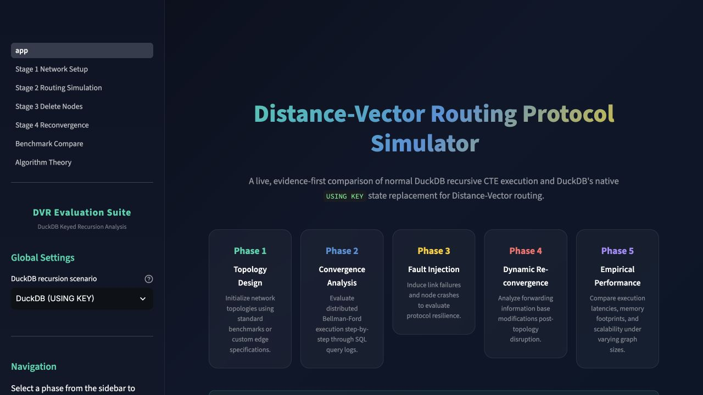
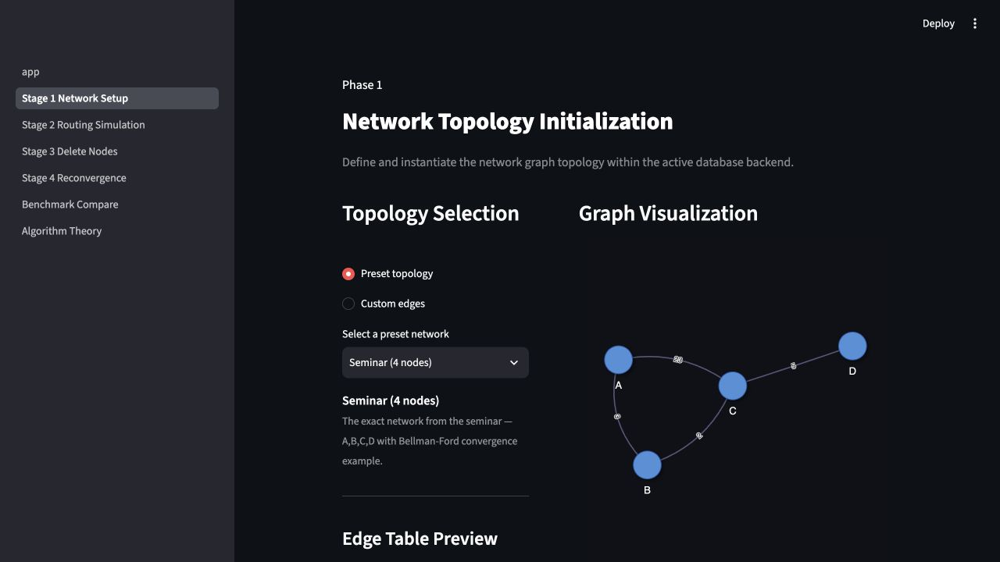
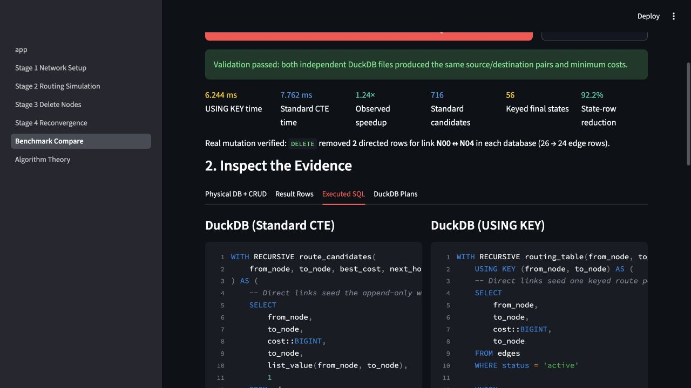
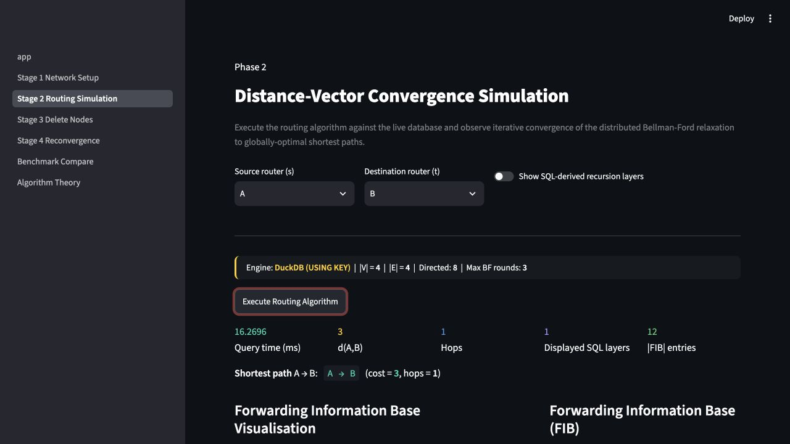
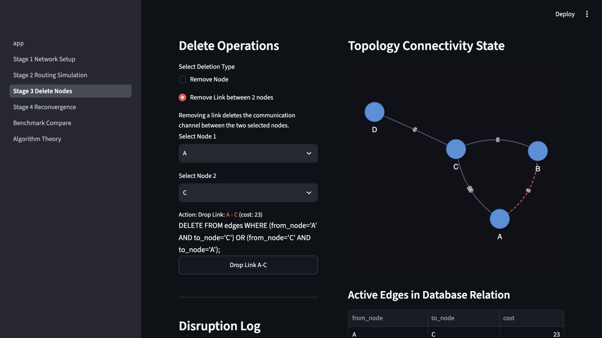
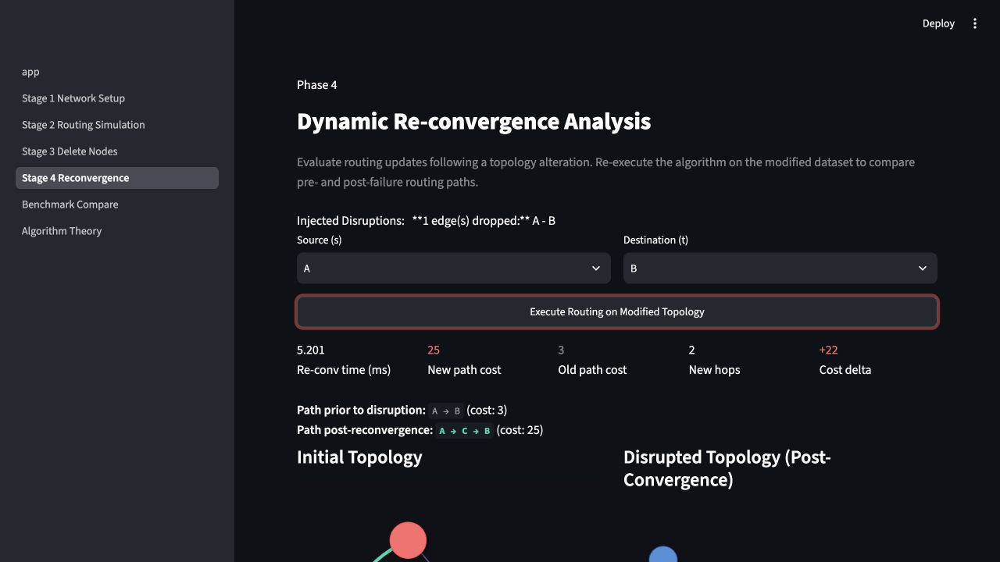
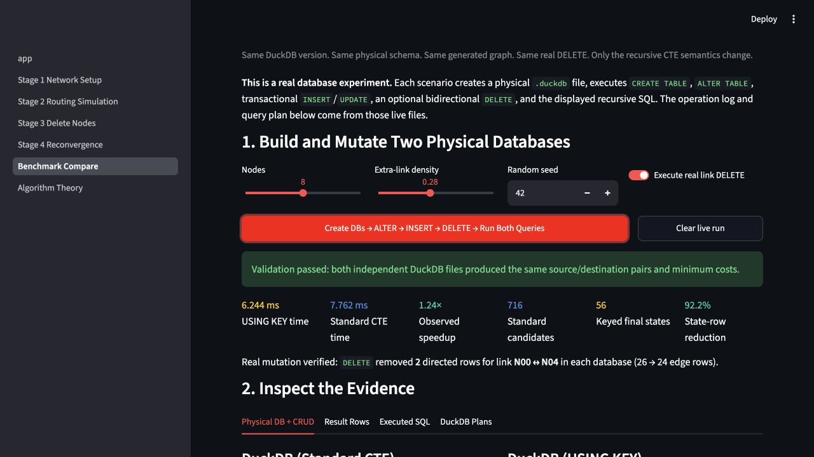
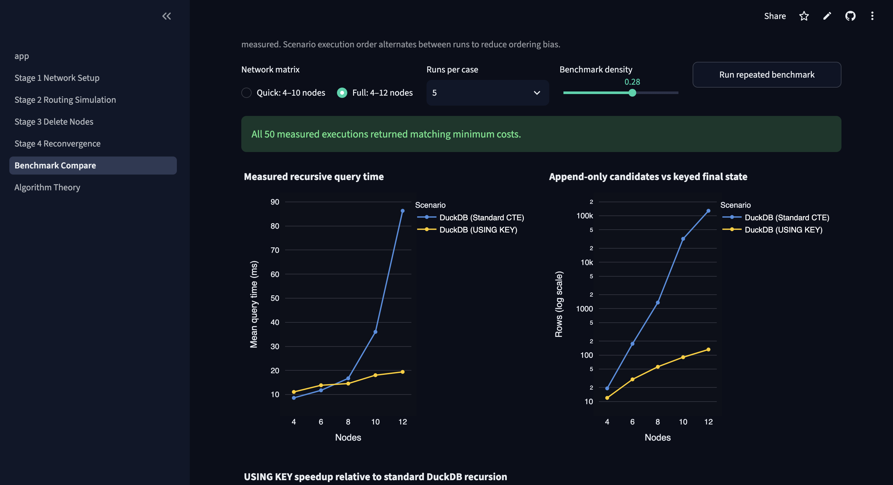

_What changes when a recursive SQL query can update its state instead of remembering every intermediate row? I built a real, reproducible DuckDB experiment around Distance-Vector Routing to find out._

SQL is usually introduced as a language for asking questions about stored data. This project asks a more ambitious question: **can SQL also express a stateful, iterative algorithm clearly enough to function as a programming language?**

Distance-Vector Routing is a demanding test. Each router begins with incomplete, local knowledge. Routers repeatedly advertise what they know, improve their tables when a cheaper route appears, and eventually converge on globally shortest paths. When a link fails, those decisions must be computed again against the changed network.

The project connects algorithm theory, recursive-query semantics, physical database operations, correctness validation, failure recovery, and controlled performance measurement. The goal is not merely to visualize routing. It is to isolate what changes when the recursive relation itself can represent the algorithm's current state.

## The project in one view

| Dimension               | What this research investigates                                                                     |
| ----------------------- | --------------------------------------------------------------------------------------------------- |
| **Core idea**           | SQL as a language for iterative, stateful computation—not only data retrieval                       |
| **Algorithmic model**   | Bellman–Ford Distance-Vector Routing and local cost relaxation                                      |
| **Controlled variable** | Normal append-only recursion versus DuckDB `USING KEY` state replacement                            |
| **Physical system**     | Two real `.duckdb` files with identical schema, topology, DDL, and mutations                        |
| **Dynamic behavior**    | Initial convergence, real link deletion, and route re-convergence                                   |
| **Evidence**            | Executed SQL, plans, operation logs, result fingerprints, regression tests, and repeated benchmarks |

The experiment compares **two recursive state models inside the same DuckDB engine**:

1. A normal recursive CTE that retains simple-path candidates and ranks them after recursion.
2. DuckDB's `USING KEY` recursive CTE, which maintains one replaceable state row per route key.

Both scenarios receive the same topology, use the same schema, execute the same DDL and mutations, and return the same minimum-cost contract. Only the recursive relation semantics change. This makes the work a study of state representation inside recursive SQL—not a comparison between unrelated database products.

## The research question

The central hypothesis is simple:

> If the output we need is one current best route per source–destination pair, recursive execution should be able to represent that state directly instead of preserving every route candidate it has ever discovered.

This matters because a normal recursive CTE is accumulative. Each iteration contributes rows to a union table. That model is excellent when history is the desired result, but graph algorithms can produce a large intermediate search space even when their final state is compact.

DuckDB introduced `USING KEY` in version 1.3. Instead of treating the recursive union table as append-only, the keyed variant can replace the payload of an existing key. DuckDB also exposes the complete state accumulated so far through the `recurring` schema. The feature was developed specifically to make stateful iterative algorithms more natural and to control intermediate-state growth; the [DuckDB documentation](https://duckdb.org/docs/stable/sql/query_syntax/with#recursive-ctes-with-using-key), [engineering article](https://duckdb.org/2025/05/23/using-key), and [SIGMOD 2025 demonstration paper](https://duckdb.org/library/bamberg-using-key-sigmod/) describe its semantics and implementation.

## Why Distance-Vector Routing is a useful test

Distance-vector protocols are grounded in the Bellman–Ford recurrence. For a source router \(u\) and destination \(v\), the best known distance is:

$$
d(u,v) = \min_{w \in \operatorname{Adj}(u)} \left\{ c(u,w) + d(w,v) \right\}
$$

In plain language: to reach a destination, a router considers each neighbor, adds the cost of reaching that neighbor to the neighbor's advertised distance, and keeps the cheapest proposal.

That maps naturally to relational operations:

- the `edges` table is the network;
- a join propagates route advertisements across adjacent links;
- `MIN` performs cost relaxation;
- `arg_min` retains the next hop belonging to the cheapest proposal;
- `(from_node, to_node)` is the identity of a routing-table entry.

The algorithm therefore exposes the exact conceptual difference under study. A physical router wants one current entry for a destination. A normal recursive CTE naturally accumulates candidates. A keyed recursive CTE can model the current table directly.

## One problem, two recursive state models

The standard scenario enumerates simple paths. A list of visited nodes prevents cycles, and a window function selects the cheapest candidate for every ordered pair only after recursion:

```sql
WITH RECURSIVE route_candidates(
    from_node, to_node, best_cost, next_hop, visited, hops
) AS (
    SELECT from_node, to_node, cost, to_node,
           list_value(from_node, to_node), 1
    FROM edges
    WHERE status = 'active'

    UNION ALL

    SELECT candidate.from_node,
           edge.to_node,
           candidate.best_cost + edge.cost,
           candidate.next_hop,
           list_append(candidate.visited, edge.to_node),
           candidate.hops + 1
    FROM route_candidates AS candidate
    JOIN edges AS edge
      ON candidate.to_node = edge.from_node
    WHERE edge.status = 'active'
      AND NOT list_contains(candidate.visited, edge.to_node)
)
-- Rank candidates and retain one minimum-cost route per pair.
```

The keyed scenario declares the routing-table identity explicitly. A better proposal for an existing `(from_node, to_node)` key replaces its cost and next-hop payload:

```sql
WITH RECURSIVE routing_table(
    from_node, to_node, best_cost, next_hop
) USING KEY (from_node, to_node) AS (
    SELECT from_node, to_node, cost, to_node
    FROM edges
    WHERE status = 'active'

    UNION

    SELECT route.from_node,
           edge.to_node,
           MIN(route.best_cost + edge.cost),
           arg_min(route.next_hop, route.best_cost + edge.cost)
    FROM routing_table AS route
    JOIN edges AS edge
      ON route.to_node = edge.from_node
    LEFT JOIN recurring.routing_table AS current_best
      ON current_best.from_node = route.from_node
     AND current_best.to_node = edge.to_node
    WHERE route.from_node <> edge.to_node
      AND (
          current_best.best_cost IS NULL OR
          route.best_cost + edge.cost < current_best.best_cost
      )
    GROUP BY route.from_node, edge.to_node
)
SELECT * FROM routing_table;
```

The query reads the latest iteration through `routing_table` and the complete current state through `recurring.routing_table`. Only previously unknown routes or strictly cheaper proposals are emitted. The recursive table behaves much more like the state structure used by the algorithm.

## A real database experiment—not a mock

An important design goal was to make the evidence observable. Each scenario owns a dedicated on-disk DuckDB database. The application executes and logs:

- `CREATE SEQUENCE` and `CREATE TABLE` statements;
- `ALTER TABLE edges ADD COLUMN link_label VARCHAR`;
- transactional `DELETE`, parameterized `INSERT`, and `UPDATE` operations when loading a topology;
- real link and node `DELETE` statements during fault injection;
- the routing query and DuckDB query plan.

The UI surfaces database paths, schemas, row counts, operation logs, result fingerprints, and the SQL text. Temporary benchmark databases are explicitly closed and disposed after a run.

This is more than implementation detail. If one scenario used a different engine, in-memory graph library, schema, or mutation path, a benchmark result could be caused by any of those differences. Here the independent variable is deliberately narrow: **append-only recursion versus keyed replacement**.



_The experiment changes the recursive semantics while controlling the rest of the system._

## From research design to an inspectable live system

After defining the theory, implementation, and controlled variables, I built an interactive research artifact so every important claim can be inspected rather than taken on trust. The application exposes the physical topology, database mutations, routing tables, executed queries, plans, result fingerprints, and repeated measurements across five connected phases.

**[Launch the interactive experiment](https://duckdb-using-key-routing.streamlit.app/)** · **[Explore the complete source and research material](https://github.com/mhdihso/Database_seminar_Distance_Vector_Routing)**



_The live artifact follows the research workflow: topology design, convergence, fault injection, re-convergence, and empirical comparison._

The seminar topology is deliberately small enough to verify by hand while still containing alternative routes and meaningful failure cases.



_A visual graph and the underlying edge relation describe the same physical DuckDB state._

The application also displays the two recursive statements it actually executes. This keeps the comparison inspectable and prevents the visualization from hiding different computational paths behind a common interface.



_The SQL, database operations, and validation evidence remain visible throughout the experiment._

### From convergence to failure and re-convergence

The application's first four phases make the routing behavior visible before the benchmark begins.

After topology creation, the selected recursive query computes all ordered source–destination routes. The interface shows the forwarding information base, the shortest path selected for a chosen pair, and the graph on which it was computed.



_The routing result is produced by the database and rendered as a forwarding table and graph._

Next, the application performs fault injection with SQL. In the captured experiment, the bidirectional A–B link is deleted from the `edges` table. The graph marks the removed link, and the operation log records the affected rows.



_Failure is a database mutation, not a visual toggle._

Re-running the same routing query against the new database state produces a different route. Before the failure, A reached B directly with cost 3. After the deletion, the best available path becomes A → C → B with cost 25—a cost increase of 22.



_No routing logic changes between the two runs; only the underlying edge relation changes._

This is the declarative advantage in its clearest form. The query specifies what constitutes a better route. The changed data determines which route satisfies it.

## Controlled results: state reduction first, timing second

The fifth phase creates two fresh physical database files, applies identical DDL and data mutations, optionally performs the same real link deletion, and then executes both recursive queries. The order alternates across benchmark runs to reduce systematic warm-up and ordering bias.

In the captured eight-node live run, both scenarios produced the same minimum-cost result fingerprint after deletion. The standard CTE generated **716 recursive path candidates**. `USING KEY` retained **56 keyed route states**—a **92.2% reduction** in the measured recursive rows. The keyed query was **1.24× faster** in that particular run.



_One live run: matching shortest-path results, identical mutations, and sharply different recursive-state sizes._

The interpretation matters. The two row metrics describe their respective execution models: all simple-path candidates for the standard query versus final keyed states for the keyed query. They are useful for showing state growth, but they are not a universal proxy for CPU time or peak memory.

Likewise, a browser screenshot is not a scientific timing conclusion. Small graphs complete in milliseconds, where process scheduling, compilation, caching, and measurement noise can dominate. The repeatable benchmark therefore runs deterministic connected graphs at several sizes, records minimum, maximum, mean, and standard deviation, alternates execution order, and verifies a result fingerprint for every paired run.



_All 50 measured executions returned matching minimum costs. The charts emphasize paired correctness and growth trends instead of presenting a single stopwatch number as a law._

The most defensible conclusion is not “keyed recursion is always faster.” It is this: **when the problem's natural state has a stable key, `USING KEY` can prevent the recursive union table from growing with obsolete alternatives.** As the graph's candidate space expands, that semantic difference creates the conditions for lower memory pressure and substantial runtime gains. This is consistent with DuckDB's own larger-graph evaluation, while the project keeps its claims tied to the measurements it actually performs.

## Correctness before performance

Performance is irrelevant if the routes are wrong. The project therefore checks correctness at several levels:

- both scenarios must return the same ordered source–destination pairs and minimum costs;
- equal-cost alternatives may select different next hops, so the fingerprint intentionally compares the shortest-path relation rather than requiring an arbitrary tie-break to match;
- regression tests verify physical file creation, schema alteration, real updates and deletes, operation logging, and temporary-database disposal;
- every paired benchmark execution records whether the result fingerprints match;
- the interactive failure flow makes before/after route changes manually inspectable.

The test suite passes against the same implementation used by the demo. The full benchmark shown above also completed all 50 executions with matching route results.

## What this project demonstrates—and what it does not

This work supports three conclusions.

First, SQL can express a meaningful iterative algorithm as more than a reporting query. Joins model message propagation, aggregation models relaxation, recursion models repeated rounds, and a relational key models algorithmic state.

Second, data-model semantics affect algorithm design. Standard recursion and keyed recursion can return the same answer while taking very different routes through the intermediate search space.

Third, a convincing systems demo should expose evidence. Real database files, mutation logs, executed SQL, result fingerprints, plans, repeated measurements, and failure cases make the project falsifiable and reproducible.

There are also clear limits. This is a centralized simulation of distance-vector computation, not an implementation of an asynchronous production routing protocol. It does not model message delay, packet loss, split horizon, poison reverse, hold-down timers, or the classic count-to-infinity problem. The benchmark uses small deterministic synthetic graphs rather than Internet-scale operational topologies. Its recursive-row metrics are intentionally model-specific, and end-to-end timings include more than the recursive operator alone.

Those limits point directly to future research: asynchronous update schedules, negative or changing weights, routing-policy constraints, BGP-style path vectors, comparisons with link-state algorithms, peak-memory instrumentation, and evaluation on established graph datasets.

## Try the research artifact

The best way to understand keyed recursion is to change the state yourself:

1. Open the **[live DuckDB Distance-Vector Routing demo](https://duckdb-using-key-routing.streamlit.app/)**.
2. Create or customize a weighted topology.
3. Run convergence with either normal DuckDB recursion or DuckDB `USING KEY`.
4. Delete a real link or node and observe re-convergence.
5. Open **Benchmark Compare** to create both databases, execute the SQL, inspect their plans, and run the repeated comparison.

The complete implementation, paper sources, SQL walkthroughs, presentation material, Streamlit application, and tests are available in the **[project repository](https://github.com/mhdihso/Database_seminar_Distance_Vector_Routing)**.

The broader lesson is not that every algorithm belongs in SQL. It is that the boundary of SQL changes when recursion gains explicit, updateable state. For algorithms organized around “one current best value per key,” DuckDB's `USING KEY` turns a useful query mechanism into something that feels remarkably close to an algorithmic programming model.

---

### Research references

- Richard Bellman, “[On a Routing Problem](https://doi.org/10.1090/qam/102435),” _Quarterly of Applied Mathematics_, 1958.
- DuckDB Documentation, “[Recursive CTEs with `USING KEY`](https://duckdb.org/docs/stable/sql/query_syntax/with#recursive-ctes-with-using-key).”
- Björn Bamberg and Torsten Grust, “[USING KEY in Recursive CTEs](https://duckdb.org/2025/05/23/using-key),” DuckDB Engineering Blog, 2025.
- Björn Bamberg, Denis Hirn, and Torsten Grust, “[How DuckDB is USING KEY to Unlock Recursive Query Performance](https://duckdb.org/library/bamberg-using-key-sigmod/),” SIGMOD 2025.
