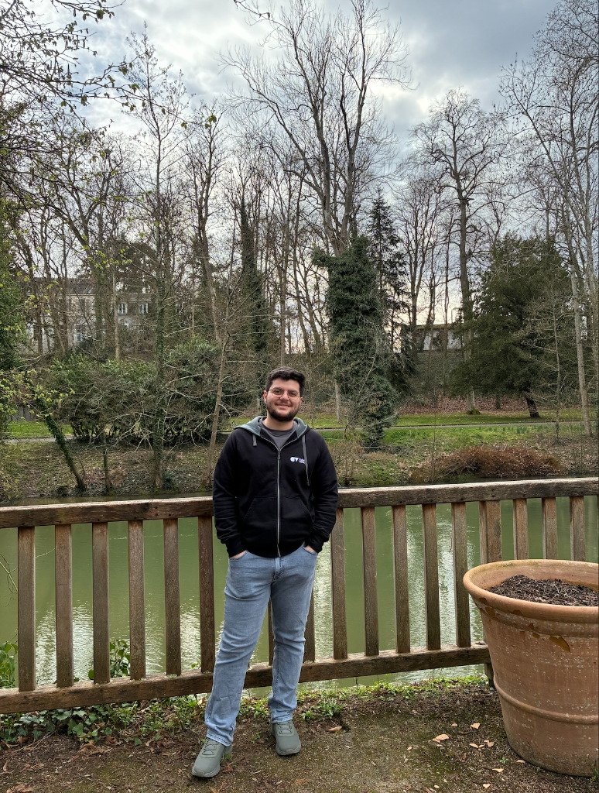

  
  

    
Backend & Distributed Systems Engineer

    
Backend engineer and <strong>co-founder</strong> with 5+ years building production-grade distributed systems, high-throughput APIs, event-driven pipelines, and containerized infrastructure. From designing <strong>Kafka streaming architectures</strong> and orchestrating services with <strong>Kubernetes & Docker Swarm</strong>, to optimizing complex multi-table queries against real enterprise-scale databases at <strong>Deutsche Bundesbank</strong> and <strong>Robert Bosch GmbH</strong> — I build systems that scale under real-world load.

    

      🏢 Robert Bosch GmbH
      🏛️ Deutsche Bundesbank
      🚀 Co-Founder · NoyanFanavarArya
      🎓 M.Sc. · Univ. of Tübingen
      🟢 Open to Senior Backend / Systems Roles
    

  

---

## Core Competencies

⚙️

<h3 class="skill-card-title">Backend Engineering</h3>
<ul class="skill-card-list">
<li>Python · Django · FastAPI · REST APIs</li>
<li>Java · JavaScript · Clean Architecture</li>
<li>Microservices · Event-Driven Design</li>
<li>Service decomposition & API contracts</li>
</ul>

🗄️

<h3 class="skill-card-title">Databases & Query Engineering</h3>
<ul class="skill-card-list">
<li>PostgreSQL · MongoDB · Redis</li>
<li>Complex SQL · Query plan analysis</li>
<li>Schema design & index optimization</li>
<li>Enterprise-scale DB at Deutsche Bundesbank</li>
</ul>

🐳

<h3 class="skill-card-title">DevOps & Infrastructure</h3>
<ul class="skill-card-list">
<li>Docker · Kubernetes · Docker Swarm</li>
<li>Container orchestration at scale</li>
<li>Linux server administration</li>
<li>CI/CD pipelines · Git workflows</li>
</ul>

📡

<h3 class="skill-card-title">Distributed Systems</h3>
<ul class="skill-card-list">
<li>Apache Kafka · Event streaming</li>
<li>Load balancing strategies</li>
<li>Observability & monitoring stacks</li>
<li>Fault-tolerant system design</li>
</ul>

🔍

<h3 class="skill-card-title">Data & AI Systems</h3>
<ul class="skill-card-list">
<li>DuckDB · Recursive query research</li>
<li>Information retrieval & search ranking</li>
<li>AI-driven data pipelines</li>
<li>Data validation at enterprise scale</li>
</ul>

🧠

<h3 class="skill-card-title">Leadership & Soft Skills</h3>
<ul class="skill-card-list">
<li>Co-founder & technical lead (5 years)</li>
<li>Cross-functional team collaboration</li>
<li>Architecture & system design decisions</li>
<li>German C1 · English B2 · Persian native</li>
</ul>

---

## Where I've Shipped

| Company | Role | Scope |
| :--- | :--- | :--- |
| **Robert Bosch GmbH** | Working Student | SQL pipelines, AI-driven data workflows, enterprise web apps |
| **Deutsche Bundesbank** | IT Intern | Complex SQL validation for monetary policy systems |
| **NoyanFanavarArya** | Co-Founder & Backend Lead | Full-stack ownership — infra, APIs, DBs, DevOps |

---

## Explore

- [[about/bio|Full Profile & Technical Depth →]]
- [[experience/index|Work Experience Timeline →]]
- [[projects/duckdb-recursive-features|DuckDB Recursive Query Research →]]
- [[projects/ai-search-systems|AI & Search Systems →]]
- [[connect/index|Connect & Download CV →]]
